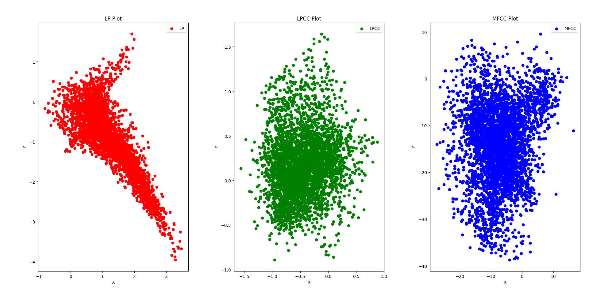
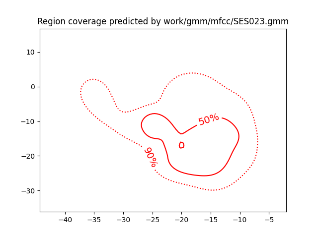
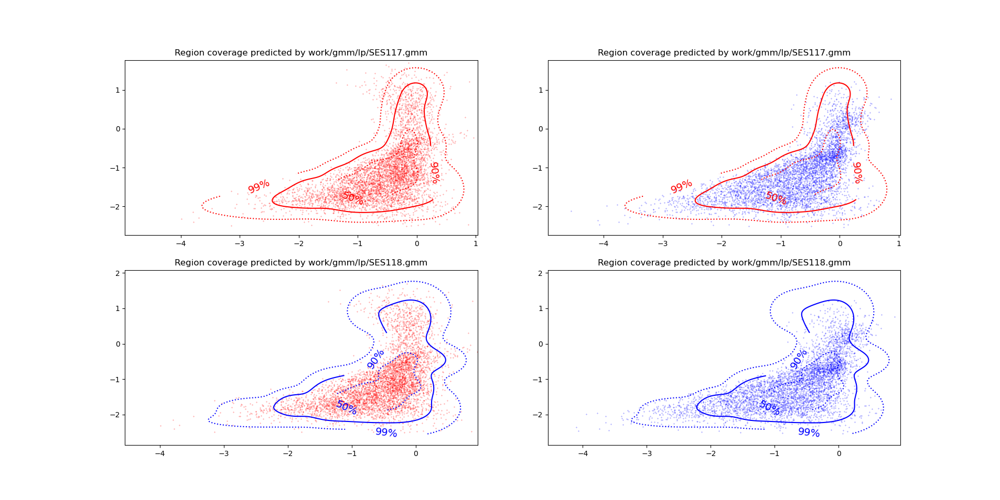

PAV - P4: reconocimiento y verificación del locutor
===================================================

Obtenga su copia del repositorio de la práctica accediendo a [Práctica 4](https://github.com/albino-pav/P4)
y pulsando sobre el botón `Fork` situado en la esquina superior derecha. A continuación, siga las
instrucciones de la [Práctica 2](https://github.com/albino-pav/P2) para crear una rama con el apellido de
los integrantes del grupo de prácticas, dar de alta al resto de integrantes como colaboradores del proyecto
y crear la copias locales del repositorio.

También debe descomprimir, en el directorio `PAV/P4`, el fichero [db_8mu.tgz](https://atenea.upc.edu/mod/resource/view.php?id=3654387?forcedownload=1)
con la base de datos oral que se utilizará en la parte experimental de la práctica.

Como entrega deberá realizar un *pull request* con el contenido de su copia del repositorio. Recuerde
que los ficheros entregados deberán estar en condiciones de ser ejecutados con sólo ejecutar:

~~~~~~~~~~~~~~~~~~~~~~~~~~~~~~~~~~~~~~~~~~~~~~~~~~~~~.sh
  make release
  run_spkid mfcc train test classerr verify verifyerr
~~~~~~~~~~~~~~~~~~~~~~~~~~~~~~~~~~~~~~~~~~~~~~~~~~~~~

Recuerde que, además de los trabajos indicados en esta parte básica, también deberá realizar un proyecto
de ampliación, del cual deberá subir una memoria explicativa a Atenea y los ficheros correspondientes al
repositorio de la práctica.

A modo de memoria de la parte básica, complete, en este mismo documento y usando el formato *markdown*, los
ejercicios indicados.

## Ejercicios.

### SPTK, Sox y los scripts de extracción de características.

- Analice el script `wav2lp.sh` y explique la misión de los distintos comandos involucrados en el *pipeline*
  principal (`sox`, `$X2X`, `$FRAME`, `$WINDOW` y `$LPC`). Explique el significado de cada una de las 
  opciones empleadas y de sus valores.

    ```bash 
    sox $inputfile -t raw -e signed -b 16 - | $X2X +sf | $FRAME -l 240 -p 80 | $WINDOW -l 240 -L 240 | $LPC -l 240 -m $lpc_order > $base.lp || exit 1
    ```

### sox:
Converteix la senyal d'entrada a nombres reals en coma flotant de 16 bits sense capçalera (raw), i escriu el resultat a la sortida estàndard.
- -t: Tipus de fitxer d'àudio (raw).
- -e: Tipus de codificació (signed).
- -b: Mida de la mostra codificada, en bits. (16)

### $X2X:
Programa de SPTK que permet la conversió entre diferents formats de dades. Fem aquesta operació en dos passos perquè x2x no permet llegir fitxers en format WAVE (o qualsevol altre, només permet RAW). En aquest cas +sf indica s (short, 2 bytes) i f (float, 4 bytes).

### $FRAME:
Divideix la senyal d'entrada en trames de 240 mostres (30 ms) amb desplaçament de finestra de 80 mostres (10 ms). Tingueu en compte que la freqüència de mostreig és de 8 kHz.
- -l: longitud de trama (240).
- -p: període de trama (80).

### $WINDOW:
Multiplica cada trama per la finestra de Blackman (opció per defecte).
- -l: longitud de trama d'entrada (240).
- -L: longitud de trama de sortida (240).

### $LPC:
Calcula els lpc_order primers coeficients de predicció lineal, precedits pel factor de guany del predictor.
- -l: longitud de trama (240)
- -m: ordre de LPC ($lpc_order)

Observem com finalment el resultat del pipeline es redirecciona a un fitxer temporal $base.lp, el nom del qual és el mateix que el de l'script seguit de l'identificador del procés (d'aquesta manera s'aconsegueix un fitxer temporal únic per a cada execució).

- Explique el procedimiento seguido para obtener un fichero de formato *fmatrix* a partir de los ficheros de
  salida de SPTK (líneas 45 a 51 del script `wav2lp.sh`).

    ```bash 
      # Main command for feature extration
      sox $inputfile -t raw -e signed -b 16 - | $X2X +sf | $FRAME -l 240 -p 80 | $WINDOW -l 240 -L 240 |
      $LPC -l 240 -m $lpc_order > $base.lp || exit 1
    

      # Our array files need a header with the number of cols and rows:
      ncol=$((lpc_order+1)) # lpc p =>  (gain a1 a2 ... ap) 
      nrow=`$X2X +fa < $base.lp | wc -l | perl -ne 'print $_/'$ncol', "\n";'`

      # Build fmatrix file by placing nrow and ncol in front, and the data after them
      echo $nrow $ncol | $X2X +aI > $outputfile
      cat $base.lp >> $outputfile 
    ```

    > Un cop emmagatzemat el resultat de la parametrització en un fitxer temporal ($base.lp), hem de guardar la informació en un fitxer fmatrix.
    - Nombre de columnes = ordre del predictor + 1. Cal afegir 1 ja que en el primer element del vector s'emmagatzema el guany de predicció -> (guany a1 a2 ... ap)
    - Nombre de files. Les extreiem del fitxer obtingut. Ho fem convertint la senyal parametritzada a text usant sox +fa, i comptant el nombre de línies amb la comanda UNIX wc -l.
    Aquesta obtenció del nombre de files depèn de la longitud de la senyal, la longitud i el desplaçament de la finestra, i la cadena de comandes que s'executen per obtenir la parametrització.

  * ¿Por qué es más conveniente el formato *fmatrix* que el SPTK?

    > Utilitzant aquest format es pot passar d'una senyal d'entrada que és una senyal unidimensional (un vector) amb les mostres de la senyal d'àudio a una matriu en la qual es té un accés fàcil i ràpid a totes les dades emmagatzemades. A més, hi ha una correspondència directa entre la posició a la matriu i l'ordre del coeficient i el nombre de trama, la qual cosa simplifica molt la seva manipulació a l'hora de treballar. També ofereix informació directa a la capçalera sobre el nombre de trames i de coeficients calculats.W

- Escriba el *pipeline* principal usado para calcular los coeficientes cepstrales de predicción lineal
  (LPCC) en su fichero <code>scripts/wav2lpcc.sh</code>:

    >Este es el pipeline principal:
    ```bash 
    sox $inputfile -t raw -e signed -b 16 - | $X2X +sf | $FRAME -l 240 -p 80 | $WINDOW -l 240 -L 240 |
    $LPC -l 240 -m $lpc_order | $LPCC -m $lpc_order -M $cepstrum_order> $base.lpcc || exit 1
    ```


- Escriba el *pipeline* principal usado para calcular los coeficientes cepstrales en escala Mel (MFCC) en su
  fichero <code>scripts/wav2mfcc.sh</code>:

    >Este es el pipeline principal:
    ```bash 
    sox $inputfile -t raw -e signed -b 16 - | $X2X +sf | $FRAME -l 240 -p 80 | $WINDOW -l 240 -L 240 |
    $MFCC -l 240 -m $mfcc_order -n $filter_bank_order -s $freq > $base.mfcc|| exit 1
    ```


### Extracción de características.

- Inserte una imagen mostrando la dependencia entre los coeficientes 2 y 3 de las tres parametrizaciones
  para todas las señales de un locutor.

    
  
  + Indique **todas** las órdenes necesarias para obtener las gráficas a partir de las señales parametrizadas.

  Primer hem generat totes les característiques per tots el locutors de train mitjançant el script `run_spkid.sh`:

  ```bash
    FEAT=lp run_spkid lp    
    FEAT=lpcc run_spkid lpcc 
    FEAT=mfcc run_spkid mfcc 
  ```

  Després hem guardat en un arxiu `.txt` dins de la carpeta plots els coeficients a(2) i a(3) del locutor **BLOCK02/SES023**:

    ```bash 
    fmatrix_show work/lp/BLOCK02/SES023/*.lp | egrep '^\[' | cut -f4,5 > plots/lp.txt    
    fmatrix_show work/lpcc/BLOCK02/SES023/*.lpcc | egrep '^\[' | cut -f4,5 > plots/lpcc.txt 
    fmatrix_show work/mfcc/BLOCK02/SES023/*.mfcc | egrep '^\[' | cut -f4,5 > plots/mfcc.txt 
    ```

  Finalment, hem creat un script de python `plots/plot.py` per plotjear els coeficients:
  ```python
    import numpy as np
    import matplotlib.pyplot as plt

    # Cargar los datos desde el archivo de texto
    data = np.loadtxt('/home/victhor/PAV/P4/plots/lp.txt')
    data2 = np.loadtxt('/home/victhor/PAV/P4/plots/lpcc.txt')
    data3 = np.loadtxt('/home/victhor/PAV/P4/plots/mfcc.txt')


    # Separar los datos en dos arrays
    x = data[:, 0]
    y = data[:, 1]

    x2 = data2[:, 0]
    y2 = data2[:, 1]

    x3 = data3[:, 0]
    y3 = data3[:, 1]

    # Crear la gráfica
    plt.figure(figsize=(10, 5))

    # Plot 1: LP
    plt.subplot(1, 3, 1)
    plt.scatter(x, y, label='LP', color='red', linestyle='dashed', marker='o')
    plt.xlabel('X')
    plt.ylabel('Y')
    plt.title('LP Plot')
    plt.legend()

    # Plot 2: LPCC
    plt.subplot(1, 3, 2)
    plt.scatter(x2, y2, label='LPCC', color='green', marker='o')
    plt.xlabel('X')
    plt.ylabel('Y')
    plt.title('LPCC Plot')
    plt.legend()

    # Plot 3: MFCC
    plt.subplot(1, 3, 3)
    plt.scatter(x3, y3, label='MFCC', color='blue', marker='o')
    plt.xlabel('X')
    plt.ylabel('Y')
    plt.title('MFCC Plot')
    plt.legend()

    # Ajustar los subplots
    plt.tight_layout()

    # Mostrar la gráfica
    plt.show()
  ```
  + ¿Cuál de ellas le parece que contiene más información?
  Les gràfiques que semble tenir més informació son les de MFCC y LPCC, que el 2 i el 3 coeficient estan molt més incorrelat, és a dir tenen més entropia. En canvi, els coeficients del LPC existeix una correlació negativa, i per tant, no s'obtè tanta informació.  

- Usando el programa <code>pearson</code>, obtenga los coeficientes de correlación normalizada entre los
  parámetros 2 y 3 para un locutor, y rellene la tabla siguiente con los valores obtenidos.

  |                        | LP   | LPCC | MFCC |
  |------------------------|:----:|:----:|:----:|
  | &rho;<sub>x</sub>[2,3] |-0.781375|0.11317 |0.130165|
  
  + Compare los resultados de <code>pearson</code> con los obtenidos gráficamente.

  Tal com era evident als gràfics, els coefcients de LPCC i MFCC tenen valors de rho més próxims a 0 (el que implica incorrelació) que els de LP que presenten un valor pròxim a -1, mostrant una alta correlació negativa.
  
- Según la teoría, ¿qué parámetros considera adecuados para el cálculo de los coeficientes LPCC y MFCC?

LPCC: de 8 a 12 coeficients de predicció (P) i (3/2)P coeficients cepstrals (Q).

MFCC: Es fan servir entre 14 i 18 coeficients pel reconeixement del parlant. Es sol utilitzar de 24 a 40 filtres pasa-banda en l'escala Mel, tot i que també s'obtenen bons resultats amb 20.

### Entrenamiento y visualización de los GMM.

Complete el código necesario para entrenar modelos GMM.

- Inserte una gráfica que muestre la función de densidad de probabilidad modelada por el GMM de un locutor
  para sus dos primeros coeficientes de MFCC.

  

- Inserte una gráfica que permita comparar los modelos y poblaciones de dos locutores distintos (la gŕafica
  de la página 20 del enunciado puede servirle de referencia del resultado deseado). Analice la capacidad
  del modelado GMM para diferenciar las señales de uno y otro.

  

### Reconocimiento del locutor.

Complete el código necesario para realizar reconociminto del locutor y optimice sus parámetros.

- Inserte una tabla con la tasa de error obtenida en el reconocimiento de los locutores de la base de datos
  SPEECON usando su mejor sistema de reconocimiento para los parámetros LP, LPCC y MFCC.

  |                        | LP   | LPCC | MFCC |
  |------------------------|:----:|:----:|:----:|
  | error rate |10.7 %|0.13 % |1.03 %|

  Els millors parámetres pel LP son:
  - order = 10
  - num mixtures = 30
  - init: EM
  - max iter: 30
  
  Per altra banda, els millors parámetres pel LPCC:
  - order = 30
  - cepstrum order: 28
  - num mixtures = 26
  - init: VQ
  - max iter: 20
  

  Finalment, els millors parámetres pel MFCC:
  - order = 20
  - filter bank: 25
  - frequency: 16
  - num mixtures = 30
  - init: VQ
  - max iter: 30

### Verificación del locutor.

Complete el código necesario para realizar verificación del locutor y optimice sus parámetros.

- Inserte una tabla con el *score* obtenido con su mejor sistema de verificación del locutor en la tarea
  de verificación de SPEECON. La tabla debe incluir el umbral óptimo, el número de falsas alarmas y de
  pérdidas, y el score obtenido usando la parametrización que mejor resultado le hubiera dado en la tarea
  de reconocimiento.


  |                        | LP   | LPCC | MFCC |
  |------------------------|:----:|:----:|:----:|
  | optimum th |0.551303960907594|0.204540440195004 |0.622179747163205|
  | cost detection |45.4|5.9 | 12.8|
  | false alarm |14/1000=0.0140|3/1000=0.0030 |4/1000=0.0040|
  | misses |82/250=0.3280|8/250=0.0320 |23/250=0.0920|

 
### Test final

- Adjunte, en el repositorio de la práctica, los ficheros `class_test.log` y `verif_test.log` 
  correspondientes a la evaluación *ciega* final.

### Trabajo de ampliación.

- Recuerde enviar a Atenea un fichero en formato zip o tgz con la memoria (en formato PDF) con el trabajo 
  realizado como ampliación, así como los ficheros `class_ampl.log` y/o `verif_ampl.log`, obtenidos como 
  resultado del mismo.
